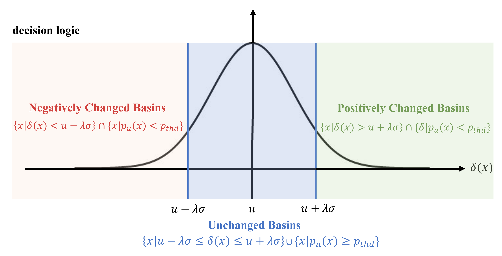
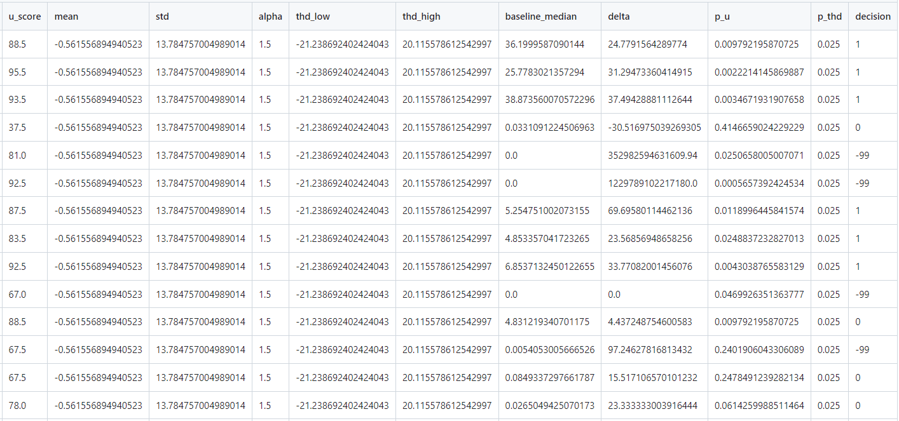
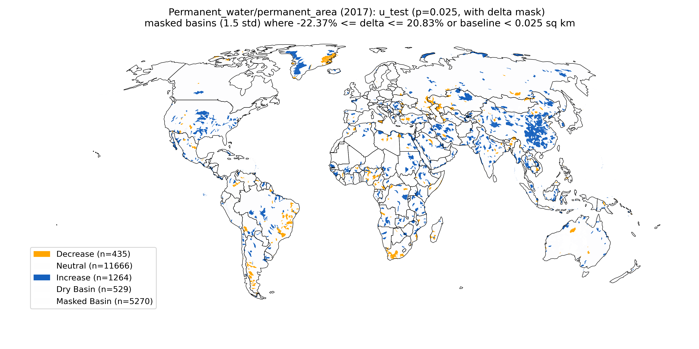
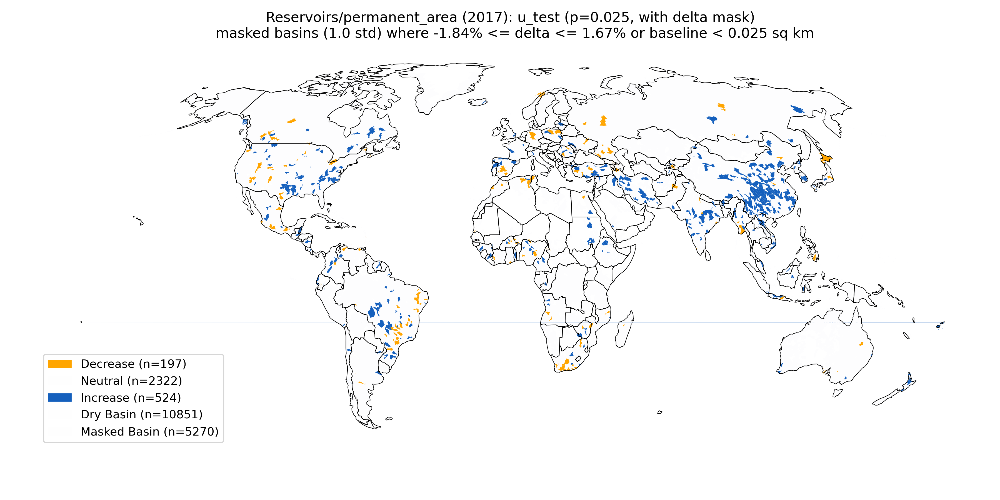

# SDG661-Fresh-Water
This project aims to analyze the temporal changes of pemanenet water and resovoirs at various basin levels.

## Delta Methods: Relative Changes 
The objective is to evaluate the relative changes between the report period (2017-2021) and baseline (2000-2019). 

For a given basin $x$, the relative change $\delta(x)$ can be defined as:

$\delta(x) = \frac{\gamma(x)-\beta(x)}{\beta(x) + \epsilon}$ * 100 

where $\delta(x)$ denotes the percentage of change in spatial extent, $\beta(x)$ denotes the median spatial extent for the baseline period (2000-2019), while $\gamma(x)$ denotes the median spatial extent for the report period (2017-2021). 
To handle the case when $\beta(x) = 0$, we used $\epsilon = 1e^{-5}$ by default.

Having $\delta(x_i)$ for $N$ basins, where $x_i$ denotes $i$-th basin, we can calculate the corresponding mean and standard deviation:

$\mu = \frac{1}{N} \sum \delta(x_i)$ 

$\sigma = \sqrt{\frac{1}{N} \sum (\delta(x_i) - \mu)^2}$


Based on $\mu$ and $\sigma$, low and high thresholds can be determined by specifying a $\lambda$ (we adopted $\lambda$ = 1.5 for Permanent water and $\lambda$ = 1.0 for Reservoirs): 

$\delta_{low\_{thd}} = \mu - \lambda \sigma$ 

$\delta_{high\_{thd}} = \mu + \lambda \sigma$ 


## U-Test (or T-Test) Methods
Evaluate the significance of difference bewteen two groups, i.e., report period (2017-2021) and baseline (2000-2019)

Null Hypothesis: The null hypothesis (H0) is a general statement or default position that there is no relationship between two measured phenomena or no association among groups. 

p-value helps determine whether the observed differences or effects are statistically significant, that is, unlikely to have occurred by chance.

- A low p-value indicates that, assuming the null hypothesis is true, there is a low probability of obtaining a result as extreme as the one observed. This is usually taken as evidence that the null hypothesis is false. 

- A high p-value suggests that your observed results can occur as a result of random chance, and there is insufficient evidence to conclude that the effect exists.

### T-Test
The t-score in a t-test is a statistic that indicates how far a sample mean deviates from the population mean in units of standard error. The sign of the t-score (positive or negative) provides information about the direction of this deviation. The 

### U-Test
The U-score in the Mann-Whitney U-test, serves a similar purpose to the t-score in the t-test, but it is used in a different context. The Mann-Whitney U test is a non-parametric test used to compare two independent samples, particularly when the assumptions necessary for the t-test (like normally distributed data) are not met. The U-score represents the number of times observations in one sample precede observations in the other sample when all observations are ranked together.

To understand which group has higher or lower ranks (which might be interpreted as better or worse performance, higher or lower measurements, etc.), you need to look at the descriptive statistics (like median or mean ranks) of the two groups.

```python 
import scipy.stats as stats
# T-test (https://docs.scipy.org/doc/scipy/reference/generated/scipy.stats.ttest_ind.html)
# If equal_var is True (default), perform a standard independent 2 sample test that assumes equal population variances. If False, perform Welch’s t-test, which does not assume equal population variance .

# T-test
t_score, p_t = stats.ttest_ind(report_period, baseline_period, equal_var=False)

def get_sign(x):
    if x > 0: return 1
    elif x < 0: return -1
    else: return 0

# U-Test
median_baseline = np.median(baseline_period)
median_report = np.median(report_period)
median_diff = median_report - median_baseline

# delta
delta = median_diff / (median_baseline + 1e-15) * 100

u_sign = get_sign(median_diff)
dry_mask = median_baseline < 0.0225 # dry basin if true, precision=0.0225
if dry_mask & (median_diff != 0): u_sign = -99
```

$p_u$ < $p_{thd}$ ( $p_{thd}$ = 0.025 is taken as the significance level by default) determines a basin changes or not (True for change, False for non-change), while u_sign is the sign of delta which determines the change direction:
- 1 for positive delta 
- -1 for negative delta 
- 0 for neutral (delta = 0)
- -99 for dry basins whose baseline area is smaller than 0.0225 km $^2$ (precision: 5 pixels * 30m = 0.15km)

It is worth noting that the u_test was set as non-change/neutral if $\mu - \lambda \sigma \leq \delta  \leq \mu + \lambda \sigma$ since we trust more in delta-based approach for determining the non-change basins.

### How to make decision based on CSV tables
The final decison is determined by considering both decisions made by delta and u-test, and it is conservative to make positive or negative change decision, except for both approaches agree on this.
- positive change (+1):  only when both delta and u-test agree a basin is positve change
- negative change (-1): only when both delta and u-test agree a basin is negative change
- unchanged/neutral (0): one of delta and u-test or both suggests a basin is unchanged



```python 
""" make decision based on delta and utest, add a column named decision """
def add_decision(df, thd_low, thd_high):
    df['decision'] = None

    # negatively changed basins agreed by both delta and u-test
    df.loc[(df.delta < thd_low) & (df.p_u < p_thd), 'decision'] = -1 

    # positively changed basins agreed by both delta and u-test
    df.loc[(df.delta > thd_high) & (df.p_u < p_thd), 'decision'] = 1 

    # unchanged basins suggested by one of delta and u-test or both of them
    df.loc[((df.delta >= thd_low) & (df.delta <= thd_high)) | (df.p_u >= p_thd), 'decision'] = 0 
    
    # dry basins
    df.loc[df.baseline_median < 0.0225, 'decision'] = -99

    return df
```





## codes
```python 
# convert gaul_0 input data into same format as the other basin levels (3-8).
python step0_convert_gaul_0_data.py 

python step1_sdg661_delta_utest.py # generate delta and utest csv

python step2_make_decision.py # generate delta and utest csv

python step3_map.py # generate delta and utest csv

```


## Results

outputs_utest (with delta non-change masking) / \
├── Permanent_water \
├───── permanent_area\
├────────── basins_level_4_utest.csv\
├───── seasonal_area\
├────────── basins_level_4_utest.csv\
├── Reservoirs\
├───── permanent_area\
├───── seasonal_area

## Maps

maps_decision/Permanent_water/permanent_area/2017_utest_a_1.5_p_0.025.png


maps_decision\Reservoirs\permanent_area\2017_utest_a_1.0_p_0.025.png



```python 
# LUMI
eval "$(ssh-agent -s)" \
ssh-add ~/.ssh/id_ed25519
```